Welcome to Swan, a tool for visualizing and interpreting transcript isoforms graphically. This README should provide an overview on how to use the Swan tools and visualize important pieces of your data.

# Swan

## 0: Installing swan
In your terminal, run:
```bash
pip install swan_vis
```

## 1: Setting up your environment
 
Create a new Python file to serve as your "driver" script in the swan directory. Add the following header to your file:

```py
import swan_vis as swan
```

Then, initialize an empty SwanGraph object.

```py
sg = swan.SwanGraph()
```

## 2: Adding an annotation to your SwanGraph

To keep things flexible, you don't *technically* need to add an annotation, however for my purposes, I always have found it useful to have an annotation to compare things to. Here, I'll be using the gencode vM21 annotation (for mouse). 

```py
sg.add_annotation('input_files/gencode.vM21.annotation.gtf')
```

## 3: Adding transcript models from your transcripts

### 3.a: Adding just the models

These transcript models should be those that come from your RNA-seq dataset, in GTF format. You will give your dataset a name so that the program can record what transcripts are seen in what dataset. Here, I'm adding 2 replicates each of wildtype mouse cortex, and 5xFAD (Alzheimer's model) mouse cortex. In each call, the first argument is the name of the dataset (each name added to the SwanGraph must be unique!), and the second argument is the GTF file in which the transcript models associated with the dataset are stored.
```py
sg.add_dataset('wt_1', 'input_files/wt_1_filtered_talon.gtf')
sg.add_dataset('wt_2', 'input_files/wt_2_filtered_talon.gtf')
sg.add_dataset('5xFAD_1', 'input_files/5xFAD_1_filtered_talon.gtf')
sg.add_dataset('5xFAD_2', 'input_files/5xFAD_2_filtered_talon.gtf')
```

### 3.b: (Alternative to 3.a) Adding transcript models to your SwanGraph with expression data

Alternatively to only loading in the transcript models themselves, you can also load in both expression data and your transcript models at the same time. To do this, obtain an abundance file that contains counts corresponding to occurrence of each transcript (I got mine from [TALON](https://github.com/dewyman/TALON)). There are a few things that each abundance file needs to be processed by Swan. 
* column 'annot_transcript_id': should correspond to the transcript ids found in each GTF loaded into your SwanGraph. For instance, mine are ENSEMBL style ie. ENSMUST00000159265.1
* counts for your dataset in a column with any name (well except for 'annot_transcript_id' or 'annot_gene_id'), your counts can also be spread across multiple columns in case you're trying to combine replicates

The input to add_dataset now just includes the counts_file argument and the count_cols arguments, which should be assigned to the abundance file and a list of the columns that you wish to use as your counts columns. And in this case the columns I am using for each of my datasets are as follows:
* wt_1: PB132
* wt_2: PB133
* 5xFAD_1: PB130
* 5xFAD_2: PB131
```py
sg.add_dataset('wt_1', 'input_files/wt_1_filtered_talon.gtf',
  counts_file='input_files/wt_5xFAD_filtered_talon_abundance.tsv',
  counts_cols='PB132')
sg.add_dataset('wt_2', 'input_files/wt_2_filtered_talon.gtf',
  counts_file='input_files/wt_5xFAD_filtered_talon_abundance.tsv',
  counts_cols='PB133')
sg.add_dataset('5xFAD_1', 'input_files/5xFAD_1_filtered_talon.gtf',
  counts_file='input_files/wt_5xFAD_filtered_talon_abundance.tsv',
  counts_cols='PB130')
sg.add_dataset('5xFAD_2', 'input_files/5xFAD_2_filtered_talon.gtf',
  counts_file='input_files/wt_5xFAD_filtered_talon_abundance.tsv',
  counts_cols='PB131')
```

If you did have more than one column you want to use for counts, the syntax would look as follows:
```py
sg.add_dataset('wt', 'input_files/wt_1_filtered_talon.gtf',
  counts_file='input_files/wt_5xFAD_filtered_talon_abundance.tsv',
  counts_cols=['PB132', 'PB133'])
```
Where counts_cols is a list instead of just a string.

### 3.c: (Alternative to 3.b) Adding transcript models to your SwanGraph, then adding expression data

Also alternatively, you can add your abundance information to your SwanGraph after you've already added the transcript models. This will be accomplished using similar arguments as in 3a and 3b, but split among two function: add_dataset and add_abundance.

```py
# add the datasets first (3a)
sg.add_dataset('wt_1', 'input_files/wt_1_filtered_talon.gtf')
sg.add_dataset('wt_2', 'input_files/wt_2_filtered_talon.gtf')
sg.add_dataset('5xFAD_1', 'input_files/5xFAD_1_filtered_talon.gtf')
sg.add_dataset('5xFAD_2', 'input_files/5xFAD_2_filtered_talon.gtf')

# add the abundances
sg.add_abundance('input_files/wt_5xFAD_filtered_talon_abundance.tsv', 'PB132', 'wt_1')
sg.add_abundance('input_files/wt_5xFAD_filtered_talon_abundance.tsv', 'PB133', 'wt_2')
sg.add_abundance('input_files/wt_5xFAD_filtered_talon_abundance.tsv', 'PB130', '5xFAD_1')
sg.add_abundance('input_files/wt_5xFAD_filtered_talon_abundance.tsv', 'PB131', '5xFAD_2')
```

Similarly to 3b, if you have more than one counts columns, you can do:
```py
sg.add_abundance('input_files/wt_5xFAD_filtered_talon_abundance.tsv', ['PB132', 'PB133'], 'wt')
```

## 4: Saving and loading a SwanGraph object

Since the program typically takes a while to run the SwanGraph population/merging code, you can also save it after you're done populating it, and load it in again later.

To save your SwanGraph, simply use save_graph and pass it in the prefix for the file to save to (here it's 'input_files/wt_5xFAD_sg'. 
```py
sg.save_graph('input_files/wt_5xFAD_sg')
```
The resultant file is in the form of a pickled file (a binarized form of a python object), so you can't look at the file to try to understand your data at all. In the future, I plan on having an option to save the dataframes associated with the SwanGraph object which will further the user's ability to view and analyze their data, even outside of the context of what swan can currently do.

To load your SwanGraph, you first have to initialize an empty SwanGraph, then tell the object to just load your preexisting saved SwanGraph into the current object.
```py
sg = SwanGraph()
sg.load_graph('input_files/wt_5xFAD_sg.p')
```

## 5: Plotting a swan graph

A swan graph is the basic visualization tool for swan. It consists of showing the nodes and edges used in a particular gene.

There are a ton of plotting options you have when visualizing your transcript isoforms. Note that these are all done on a *gene level* basis. You don't REALLY want to visualize an entire transcriptome, right? 

Firstly, I'll demonstrate what the heck you're even looking at, because the graphs are difficult to interpret without some prior explanation. 

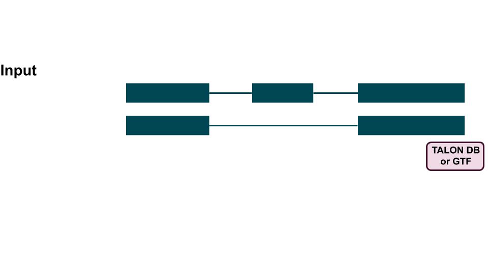


Here is a toy example of two transcript models


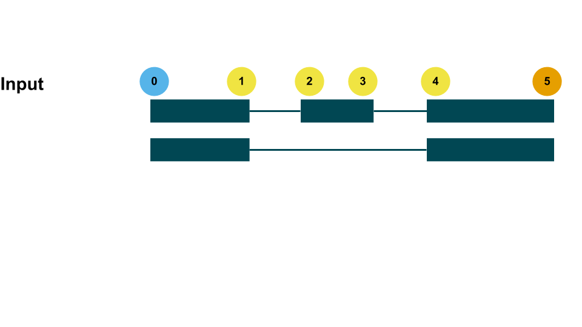


And what the basic resultant visual Swan graph would look like from it. 

* each **unique** splice junction becomes a node (circle) (these are also colored by their role in the graph where blue = TSS, orange = TES)
* each **unique** intron becomes a pink edge (arc)
* each **unique** exon becomes a green edge (arc)
* every gene will be shown with TSSs on the left, and TESs on the right, regardless of strand

**Note**: distance is meaningless in the swan graph. Each node (splice junction) is spaced out evenly.

So what sort of visualizations can we do within this schema?

### 5.a: Plotting a swan summary graph

One way to visualize splicing complexity in your gene of interest would be to generate a summary graph, in which all nodes and edges are colored. This will not give you information on the path of a single transcript isoform but will instead give you a higher-level view of what sort of splicing is happening in your gene. To generate and save a summary graph for a gene, use the following commands:

```py
sg.plot_graph('ENSMUSG00000018411.17')
sg.save_fig('figures/ENSMUSG00000018411.17_summary.png')
```

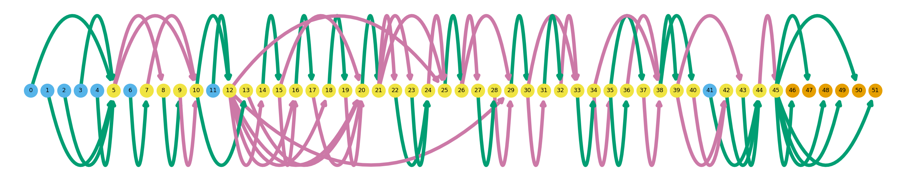

Currently, this command only accepts the gene id in terms of the id taken from GTF, in my case, the ENSEMBL ID.

**Note:** for graphs produced with *plot_graph* or *plot_transcript_path*, currently you must call *save_fig* to save a copy of a figure. This is as opposed to *gen_report* and *plot_each_transcript_in_gene*, which will automatically save the figures. The rationale behind the save_fig call is to allow the user to decide what the figure is called, whereas the latter functions generate filenames for the user.

### 5.b: Plotting a transcript's path through a swan graph
 
You also may want to visualize the path that a specific transcript isoform takes through a greater gene path. This visualization option allows for you to do just that. Edges/nodes (corresponding to introns/exons/splice junctions) that are not present in the query transcript model will be grayed out, while those that are used will be colored as usual. To do this, query using only the transcript's ID (the gene will be automatically determined).

Don't forget to call save_fig after rendering the plot!

```py
sg.plot_transcript_path('ENSMUST00000106992.9')
sg.save_fig('figures/ENSMUST00000106992.9.png')
```


### 5.c: Plot all transcript paths through a gene

Sometimes (okay probably most of the time) you don't know what exact isoform you want to look at from a gene, and instead just want to understand the differences in transcript splicing within a gene, in the form of generating a plot from 5.b for every transcript in a gene. To do this, use the following command: 

```py
sg.plot_each_transcript_in_gene('ENSMUSG00000018411.17', 'figures/wt_5xFAD')
```

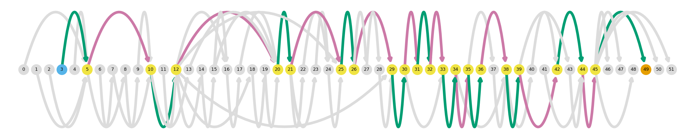
.
.
.
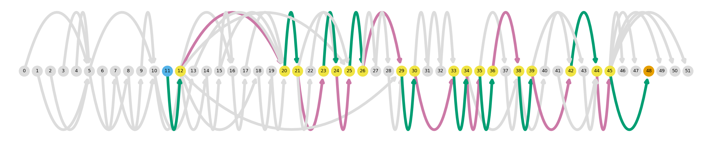

The first argument here is the gene's ENSEMBL ID, as we called the plotting functions in 5.a and 5.b. The second argument is a prefix for the output files to be saved. In contrast to the plotting functions in 5.a and 5.b, *plot_each_transcript_in_gene* automatically saves each transcript's plot with the input prefix and the transcript's ID in each of the output file names.


### 5.d: Swan graph plotting settings

In addition to being able to plot the types of graphs mentioned above, there are several settings that you can apply to the plotting functions to change the information content of the graphs. These arguments can be used for all of the following:

* *plot_graph*
* *plot_transcript_path*
* *plot_each_transcript_in_gene*

And the options you can add to each plotting function are as follows

* **combine:** Combine all non-branching paths within a gene. The goal of this argument is to reduce the visual complexity of the graph to make it easier to interpret. Resultant "combined" nodes will be hexagonal and be labelled as "c#". 

    ```py 
    sg.plot_graph('ENSMUSG00000018411.17', combine=True)
    sg.save_fig('figures/ENSMUSG00000018411.17_combined.png')
    ```

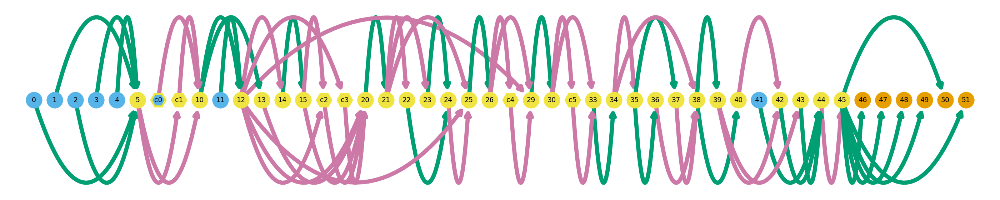

    - This option can be used with either of the following options, **indicate_dataset** or **indicate_novel**

* **indicate_novel:** "Highlight" novel nodes and edges in the graph. Novel nodes and edges correspond to splice junctions, exons, or introns that are not seen in the annotation. Resultant novel nodes will be diamond shaped, and novel exons/introns will be dashed edges.

    ```py
    sg.plot_graph('ENSMUSG00000018411.17', indicate_novel=True)
    sg.save_fig('figures/ENSMUSG00000018411.17_novel.png')
    ```

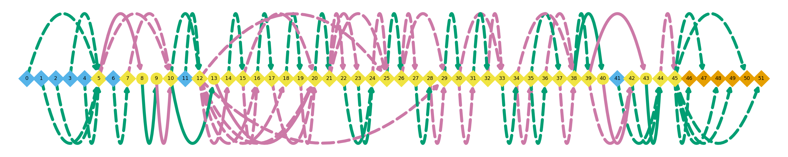


    - **This option requires that an annotation has been loaded into the graph with *add_annotation***
    - **This option cannot be used with the *indicate_dataset* option**
    - This option can be used with the *combine* option

* **indicate_dataset:** "Highlight" nodes that come from the user-specified dataset name. Highlighted nodes and edges correspond to splice junctions, exons, and introns that have been observed in the dataset that the user specifies. As with *indicate_novel*, nodes that are in the input dataset will be diamond-shaped and exons/introns observed in the dataset will be dashed edges.

    ```py
    sg.plot_graph('ENSMUSG00000018411.17', indicate_dataset='wt_1')
    sg.save_fig('figures/ENSMUSG00000018411.17_wt_1.png')
    ```


    - **This option cannot be used with the *indicate_dataset* option**
    - This option can be used with the *combine* option

## 6: Plotting browser track-style transcript model

In order to be able to compare the swan graph models with more traditional representations of transcript models, there is also an option to plot the browser track-style for plotting one transcript at a time. In these visualizations, genomic location is to scale. You can plot browser-style tracks in both *plot_transcript_path* and *plot_each_transcript_in_gene* as follows:

```py
sg.plot_transcript_path('ENSMUST00000106992.9', browser=True)
sg.save_fig('figures/ENSMUST00000106992.9_browser.png')

sg.plot_each_transcript_in_gene('ENSMUSG00000018411.17', browser=True)
```


* Note that the browser=True argument **is not compatible** with the options *combine*, *indicate_novel* or *indicate_dataset*

## 7: Generating swan reports

You can also generate a PDF report for a gene or genes that you're interested in so you can visualize all transcript models together in one place. There are also many options that you can use to generate these reports.

### 7.a: Basic swan graph report

The most basic report will comprise of a swan graph for each transcript seen in the datasets the user has added to the graph, along with columns for each dataset indicating whether or not the transcript model is present in the data ('Yes' or 'No'). The call includes the gene id (or list of gene ids) for which to generate the report, and the prefix for the output figures and PDF to be saved.

```py
# just one gene
sg.gen_report('ENSMUSG00000018411.17', 'figures/wt_5xFAD')

# multiple genes
sg.gen_report(['ENSMUSG00000018411.17', 'ENSMUSG00000051951.5'], 'figures/wt_5xFAD')
```

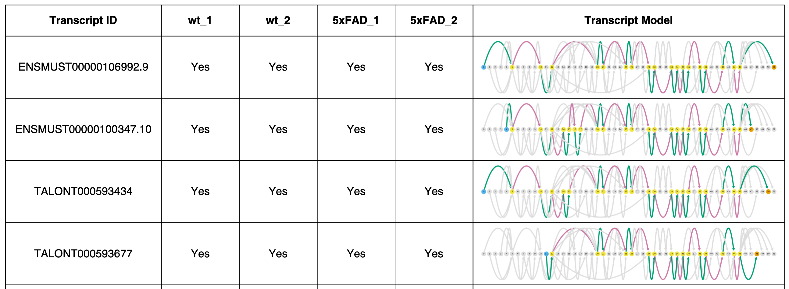


#### 7.a.i: Swan graph report options

Options that are only applicable when making a swan graph report include:
* **combine:** as described in 5.d
    ```py
    sg.gen_report('ENSMUSG00000018411.17', 'figures/wt_5xFAD', combine=True)
    ```

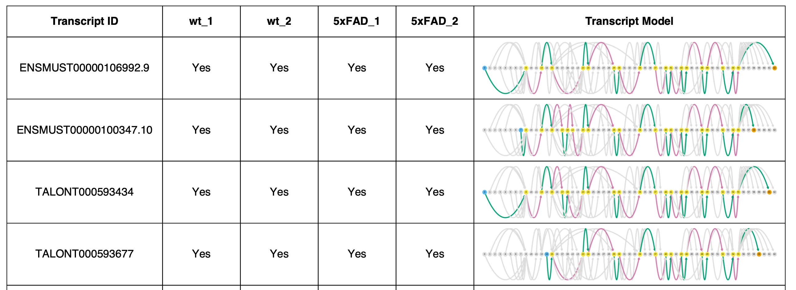

* **indicate_novel:** as described in 5.d (all restrictions ie cannot be called with *indicate_dataset* apply here too)
    ```py
    sg.gen_report('ENSMUSG00000018411.17', 'figures/wt_5xFAD', indicate_novel=True)
    ```
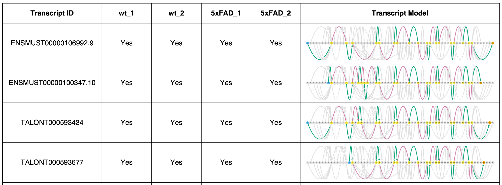

 * **indicate_dataset:** as described in 5.d (all restrictions ie cannot be called with *indicate_novel* apply here too)
    ```py
    sg.gen_report('ENSMUSG00000018411.17', 'figures/wt_5xFAD', indicate_dataset='wt_1')
    ```
 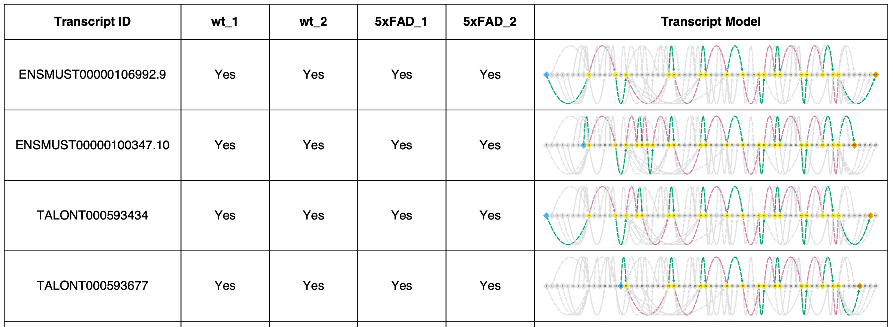


### 7.b: Browser track-style report 

You can also generate a browser-style report with the browser option as follows.

```py
sg.gen_report('ENSMUSG00000018411.17', 'figures/wt_5xFAD', browser=True)
```
 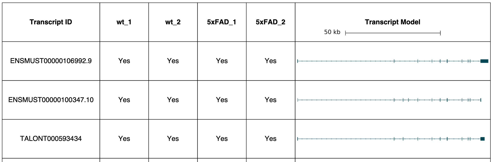

As with the other browser plotting scripts, this is incompatible with the swan graph options *combine*, *indicate_novel*, and *indicate_dataset*.

### 7.c: General report options (compatible with both swan and browser reports)

* **datasets:** choose which datasets to include in the report, default is every dataset that has been added to the graph
    ```py
    sg.gen_report('ENSMUSG00000018411.17', 'figures/wt_5xFAD', datasets=['wt_1', '5xFAD_1'])
    ```
 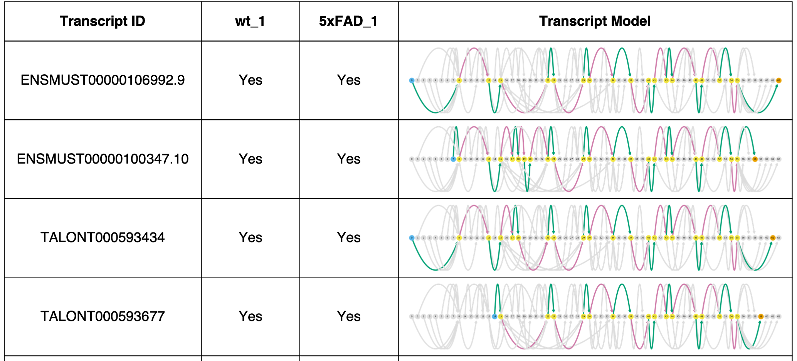

* **tpm:** instead of including presence/absence of a transcript model for each dataset in the report, give the TPM value
  * **requires abundance data to have been added to the graph**
  * **incompatible with *heatmap* option**
    ```py
    sg.gen_report('ENSMUSG00000018411.17', 'figures/wt_5xFAD', tpm=True)
    ```
 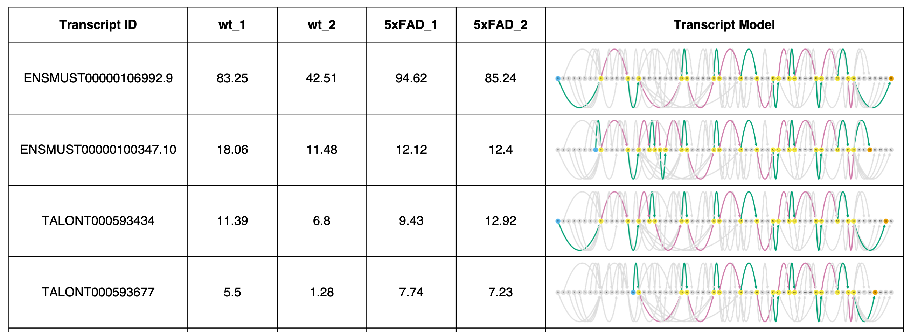

* **heatmap:** instead of using the TPM value, display expression data as a heatmap for each dataset. 
     -**requires abundance data to have been added to the graph**
    - **incompatible with *tpm* option**
    ```py
    sg.gen_report('ENSMUSG00000018411.17', 'figures/wt_5xFAD', heatmap=True)
    ```
 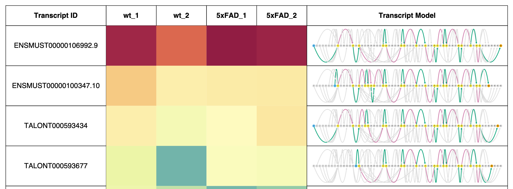

* **order:** specify the ordering of transcript models from top to bottom of the report
    - **expression (default if abundance data has been incorporated):** orders transcript models by cumulative expression across all added datasets. Maybe I should make an option to order by expression in one or more specified datasets?
    ```py
    sg.gen_report('ENSMUSG00000018411.17', 'figures/wt_5xFAD', order='expression', heatmap=True)
    ```
   

    - **tid (default if no abundance data has been incorporated):** orders transcript models alphanumerically by transcript ID
    ```py
    sg.gen_report('ENSMUSG00000018411.17', 'figures/wt_5xFAD', order='tid', heatmap=True)
    ```
    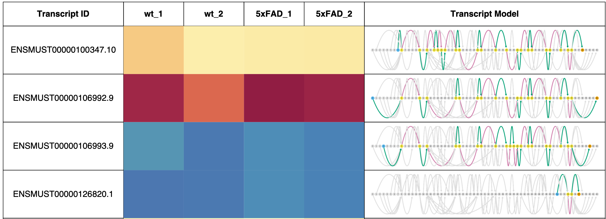

    - **tss:** orders transcript models by the genomic location of the TSS
   ```py
   sg.gen_report('ENSMUSG00000018411.17', 'figures/wt_5xFAD', order='tss', heatmap=True)
   ```
   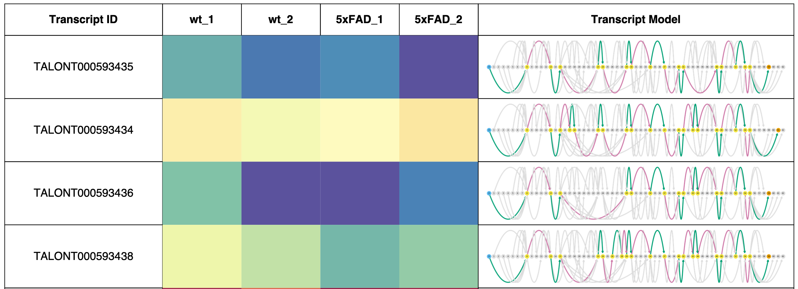

    - **tes:** orders transcript models by the genomic location of the TES
    ```py
    sg.gen_report('ENSMUSG00000018411.17', 'figures/wt_5xFAD', order='tes', heatmap=True)
    ```
    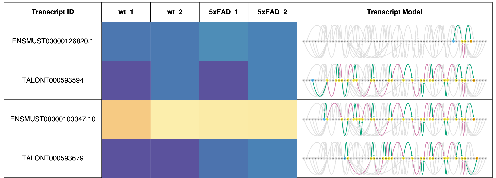

* **include_unexpressed:** by default, swan removes transcripts that are not observed in at least one dataset from the report. If, for whatever reason, you want to keep these in, use this option.
    - if you haven't loaded any datasets into the graph but have loaded an annotation in, this will change to True, because otherwise your report will be completely empty.
    ```py
    sg.gen_report('ENSMUSG00000018411.17', 'figures/wt_5xFAD', order='tid', \
      tpm=True, include_unexpressed=True)
    ```
    


## 8: Finding interesting genes to plot

What if you don't know what you're looking for in your data? The problem that every person working with genomics data inevitably faces. Swan includes a few heuristics for looking for genes that may be interesting within the context of your data. The idea would be to feed these lists of genes into the report generating function afterwards so you can inspect them to understand what's going on in the gene.

Each heuristic returns:
* **genes:** a list of the top 10 genes as found by the heuristic
* **g_df:** a dataframe indexed by gene id that you can either inspect to see the number crunching the heuristic made

### 8.a: Finding genes with lots of novel isoforms

This function will return a table of genes in your dataset ordered by how many isoforms found in your datasets are *not* in your annotation. This number is also scaled by the total number of isoforms the gene has so that genes with more isoforms overall are preferentially returned 
* **Requires that you have loaded an annotation and at least one dataset**

```py
genes, g_df = sg.find_genes_with_novel_isoforms()
```

### 8.b: Finding differentially expressed genes 

This function will return a table of genes found with the highest absolute value fold change between two datasets or lists of datasets.
* **Requires that at least two datasets with abundance information have been added to the graph**
* **This does not perform a statistical test, it is a very rudimentary implementation of finding differentially expressed genes!**

```py
genes, g_df = sg.find_differentially_expressed_genes(['wt_1', 'wt_2'], ['5xFAD_1', '5xFAD_2'])
```

This will compare the wildtype samples to the 5xFAD samples in terms of gene fold change

<!---
### 8.c Finding genes with differentially expressed transcript isoforms (isoform switching)

This function will return a table of genes found with the highest amount of isoform switching between two datasets or lists of datasets.
* **Requires that at least two datasets with abundance information have been added to the graph**
* **This does not perform a statistical test, it is a very rudimentary implementation of finding differentially expressed genes!**

```py
genes, g_df = sg.find_differentially_expressed_transcripts()
```
### 8.d Finding genes with high proportions of expression in novel transcripts
TODO
-->

### 8.e: Passing your gene lists to the report generator

After obtaining your lists of "interesting" genes from swan (you can also get a list from say, your favorite differential expression analysis software), you can pass the list into the report generator and get a report for each gene from the list.

```py
genes, g_df = sg.find_differentially_expressed_genes(['wt_1', 'wt_2'], ['5xFAD_1', '5xFAD_2'])
sg.gen_report(genes, 'figures/wt_5xFAD')
```


That's all for now, I'm hoping to add many new features and am curious to hear how it works for you and what features you'd find useful. Thanks for reading!


