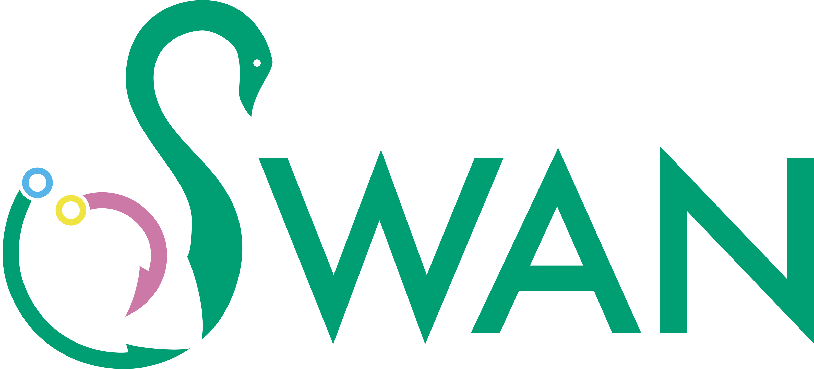

# Swan

Swan is a Python library designed for the analysis and visualization of transcriptomes, especially with long-read transcriptomes in mind. Users can merge transcriptomes from different datasets and explore transcript models distict splicing and expression patterns across datasets. 

Please see our [manuscript repository](https://github.com/fairliereese/swan_paper) for the exact commands used to do the analysis in our [manuscript](https://www.biorxiv.org/content/10.1101/2020.06.09.143024v1).

Also see our [website](https://freese.gitbook.io/swan/) for in-depth tutorials and documentation

## What can Swan do?

Swan can make informative plots, find differentially expressed genes and transcripts, find isoform-switching genes, and discover novel exon skipping and intron retention events.

## Installation

Swan can be installed directly from PyPi. To install Swan's most recent release, run

`pip install swan_vis`

<!-- Alternatively, the most recent commits can be installed by git cloning [this repo](https://github.com/fairliereese/swan_vis), moving to the swan\_vis directory, and running

`pip install .` -->

After installation with pip, to enable visualizations using dashed edges, run the following command from anywhere in the terminal

`swan_patch_networkx`

## Tutorials

* [Getting started](tutorials/getting_started.md): how to load data into Swan
* [Visualization tools](tutorials/visualization.md): make gene and transcript-level plots to visualize the complexity of alternative splicing
* [Analysis tools](tutorials/analysis_tools.md): find differentially expressed genes and transcripts; find isoform-switching genes, discover novel intron retention and exon skipping events

## FAQs

* [Understanding Swan visualizations](faqs/understanding_swan_vis.md)
* [Input file format specifications](faqs/file_formats.md)

## Comprehensive Documentation

For full documentaion, please visit [our website](https://freese.gitbook.io/swan/)

Logo by the wonderful [Eamonn Casey](https://www.instagram.com/designsbyeamonn/)

